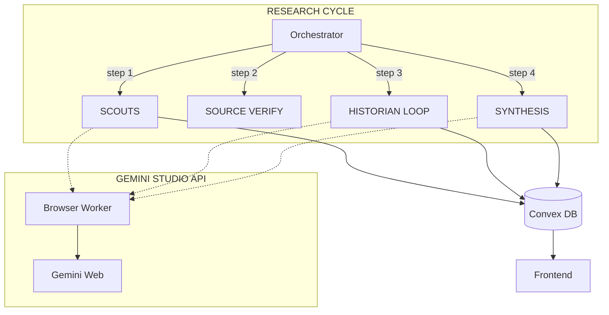

# BorderClash

> Real-time intelligence dashboard tracking the Thailand-Cambodia border situation with multi-perspective news and AI-powered neutral analysis.

[](https://github.com/South-33/BorderClash)
[](https://nextjs.org/)
[](https://convex.dev/)
[](https://tailwindcss.com/)

---

## Features

- **Trilingual UI** — English, Thai (ไทย), Khmer (ខ្មែរ) with casual/spoken translations
- **Neutral AI Analysis** — Balanced perspective summaries with credibility scoring
- **Multi-Perspective Views** — Thailand, Cambodia, and International viewpoints
- **Interactive Timeline** — Chronological event display with swipe navigation
- **Hierarchical AI System** — Scout → Source Verify → Historian → Synthesis pipeline
- **Web Search Integration** — AI agents verify claims via live web search

---

## Screenshots

*Coming soon*

---

## Architecture



### AI Components

| Component | Model | Role |
|-----------|-------|------|
| **SCOUT** | fast | Find new articles (isolated per country) |
| **SOURCE VERIFY** | fast | Visit URLs to verify article accuracy |
| **HISTORIAN** | thinking | Process articles → create/merge timeline events |
| **DASHBOARD** | thinking | Update stats (casualties, displaced) with web verification |
| **SYNTHESIS** | thinking | Generate multilingual narratives for frontend |

---

## Tech Stack

| Layer | Technology |
|-------|------------|
| Frontend | Next.js 16 + Tailwind CSS |
| Backend | Convex |
| AI | Gemini |
| Hosting | Vercel |

---

## Getting Started

### Prerequisites

- Node.js 18+
- npm or pnpm
- Convex account

### Installation

```bash
# Clone the repository
git clone https://github.com/your-username/borderclash.git
cd borderclash

# Install dependencies
npm install

# Set up Convex
npx convex dev

# Start development server
npm run dev
```

### Environment Variables

```bash
npx convex env set GEMINI_STUDIO_API_URL "https://your-api-url.com"
```

### AI Backend

This project uses a custom Gemini integration for the live deployment. If you want to run this yourself, you'll need to replace the AI layer with the [official Gemini API](https://ai.google.dev/). The prompts in `convex/research.ts` and `convex/historian.ts` are designed to be unbiased and can be audited directly in this repository.

---

## Database Schema

### News Tables
`thailandNews`, `cambodiaNews`, `internationalNews`
- Articles with `active`, `outdated`, `unverified`, `false`, or `archived` status
- Multilingual titles/summaries (En, Th, Kh)
- `sourceVerifiedAt` — When AI verified the URL/content
- `processedToTimeline` — Tracks if Historian has processed this article

### Timeline Events
`timelineEvents`
- `date`, `timeOfDay` (for same-day ordering)
- `title`, `titleTh`, `titleKh` + descriptions
- `importance` (0-100 — controls dot size)
- `status` (confirmed/disputed/debunked)
- `sources[]` array with credibility scores

### Dashboard Stats
`dashboardStats`
- Displaced Count with last updated timestamp
- Casualties (confirmed fatalities)
- Civilian/Military Injured
- Conflict Level (LOW/ELEVATED/CRITICAL)

---

## CLI Commands

```bash
# Control automation
npx convex run api:pauseTimer
npx convex run api:resumeTimer
npx convex run api:skipNextCycle

# Manual triggers
npx convex run api:runFullCycle
npx convex run api:runHistorian
npx convex run api:runDashboardUpdate

# Data management
npx convex run api:clearAllData

# Maintenance (run once after fresh deploy)
npx convex run api:initializeTimelineStats
npx convex run api:cleanupOldArticles
```

---

## Autonomous Operation

The system is designed to run indefinitely without maintenance:

- **Adaptive Scheduling** — AI decides next run time (4-48h) based on conflict intensity
- **Safety Net Cron** — 24h fallback if scheduler fails
- **Monthly Cleanup** — Auto-deletes archived articles >1 year old
- **Denormalized Stats** — O(1) reads for timeline statistics
- **ISR Caching** — Frontend served from Vercel edge, minimizing Convex bandwidth

---

## Translation Guidelines

| Language | Style |
|----------|-------|
| Thai | ภาษาพูด (spoken Thai) — casual everyday language |
| Khmer | ភាសាប្រចាំថ្ងៃ (everyday Khmer) — conversational tone |
| Numerals | Always use English numerals (0-9) |

---

## How it Works

The system utilizes a **Hierarchical AI Agent Pipeline** to process information from raw news to a structured intelligence dashboard:

1. **Scouts**: Multi-agent system that crawls news outlets from Thailand, Cambodia, and international sources. Each scout operates with a specific regional "bias" to capture the full spectrum of propaganda vs. journalism.
2. **Source Verify**: Dedicated agents visit found URLs to verify content existence and score initial credibility based on language patterns and evidentiary claims.
3. **Historian**: A "thinking" model that processes verified articles, cross-references dates, and manages the timeline database (merging duplicates, updating fatalities, etc.).
4. **Synthesis**: The final stage where the dashboard narratives are generated in three languages, ensuring tone-perfect translations for local audiences.

---

## Acknowledgments

- [Convex] for the real-time backend
- [Vercel] for hosting
- [Gemini] for AI capabilities