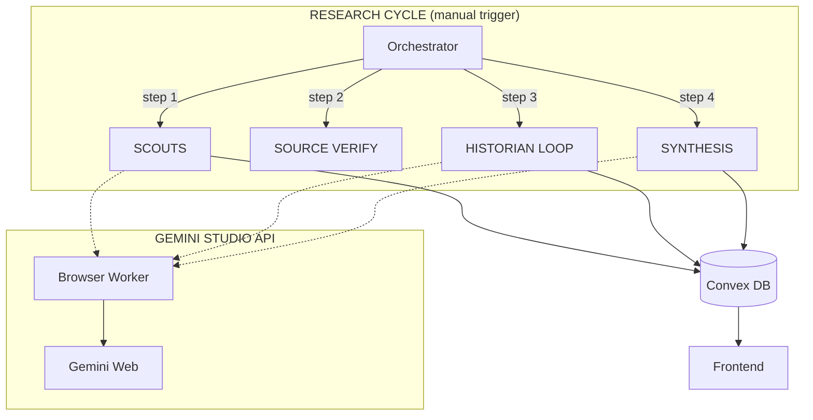

# BorderClash - Thailand-Cambodia Border Conflict Monitor

Real-time intelligence dashboard tracking the Thailand-Cambodia border situation with multi-perspective news and AI-powered neutral analysis.

## Features

- 🌐 **Trilingual UI** - English, Thai (ไทย), Khmer (ខ្មែរ) with casual/spoken translations
- 🔍 **Neutral AI Analysis** - Balanced perspective summaries, credibility scoring
- ⚔️ **Multi-Perspective** - Thailand, Cambodia, and International viewpoints
- 📅 **Interactive Timeline** - Chronological event display with swipe navigation
- 🤖 **Hierarchical AI System** - Scout → Source Verify → Historian → Synthesis pipeline
- 🛡️ **HTTP Timeout Recovery** - Automatic pending result polling when Koyeb times out
- 🔎 **Web Search Integration** - AI agents verify claims via live web search

---

## Architecture



### AI Components

| Component | Model | Role |
|-----------|-------|------|
| **SCOUT** | fast | Find new articles (isolated per country) |
| **SOURCE VERIFY** | fast | Visit URLs to verify article accuracy |
| **HISTORIAN** | thinking | Process articles → create/merge timeline events |
| **DASHBOARD** | thinking | Update stats (casualties, displaced) with web verification |
| **SYNTHESIS** | thinking | Generate multilingual narratives for frontend |

### HTTP Timeout Recovery

The gemini-studio-api handles long-running generations internally with caching.
Convex calls are simple HTTP requests with retry logic built into `ai_utils.ts`.

---

## Database Schema

### News Tables
`thailandNews`, `cambodiaNews`, `internationalNews`
- Articles with `active`, `outdated`, `unverified`, `false`, or `archived` status
- Multilingual titles/summaries (En, Th, Kh)
- `sourceVerifiedAt` - When AI verified the URL/content is real
- `processedToTimeline` - Tracks if Historian has processed this article

### Timeline Events
`timelineEvents`
- `date`, `timeOfDay` (for same-day ordering)
- `title`, `titleTh`, `titleKh` + descriptions
- `importance` (0-100 - controls dot size: 6px-40px)
- `status` (confirmed/disputed/debunked)
- `sources[]` array with credibility scores

### Dashboard Stats
`dashboardStats`
- **Displaced Count** with last updated timestamp
- **Casualties** (confirmed fatalities)
- **Civilian/Military Injured**
- **Conflict Level** (LOW/ELEVATED/CRITICAL)

---

## Tech Stack

| Layer | Technology |
|-------|------------|
| Frontend | Next.js 15 + Tailwind CSS |
| Backend | Convex |
| AI | gemini-studio-api (Playwright + Gemini Web) |
| Hosting | Vercel (frontend) + Local/Cloud (gemini-studio-api) |

### Environment Variables

```bash
npx convex env set GEMINI_STUDIO_API_URL "https://your-tunnel-url.trycloudflare.com"
```

---

## Quick Start

```bash
npm install
npx convex dev
npm run dev
```

### Administrative Commands

```bash
# Control automation
npx convex run api:pauseTimer
npx convex run api:resumeTimer
npx convex run api:skipNextCycle

# Manual triggers
npx convex run api:runFullCycle
npx convex run api:runHistorian
npx convex run api:runDashboardUpdate

# Data management
npx convex run api:clearAllData
```

---

## UI Features

- **Sticky Date Header** - Shows current visible date while scrolling timeline
- **Mobile Swipe Navigation** - Swipe between event details
- **Date Picker** - Horizontal scrollable dates with auto-sync to scroll position
- **Damage Assessment Cards** - Displaced, Fatalities, Injuries, Threat Level
- **Guide Section** - Fact vs Propaganda, Verification Checklist, Source Categories

## Translation Guidelines

- **Thai**: ภาษาพูด (spoken Thai) - casual everyday language
- **Khmer**: ភាសាប្រចាំថ្ងៃ (everyday Khmer) - conversational tone
- **Numerals**: Always use English numerals (0-9), never Thai ๑๒๓ or Khmer ១២៣

---

## Bandwidth Optimization (ISR Implementation)

### Current Architecture: Incremental Static Regeneration (ISR)

This project uses **Next.js ISR** to reduce Convex bandwidth by ~99%:

```
┌─────────────────┐     once per     ┌─────────────────┐     serve     ┌─────────┐
│  Convex (AI)    │ ──────────────►  │  Vercel CDN     │ ───────────►  │  Users  │
│  ~10MB/month!   │   3 hours        │  (Cached HTML)  │   (instant)   │         │
└─────────────────┘                  └─────────────────┘               └─────────┘
```

### How It Works

1. **Server Component** (`page.tsx`) fetches data from Convex at build/revalidation time
2. **Vercel caches** the rendered HTML globally on its CDN
3. **Users get cached HTML** - zero Convex calls per user
4. **Every 3 hours** OR after research cycle - cache is revalidated

### Environment Variables (Required for Production)

```bash
# In Vercel Dashboard -> Settings -> Environment Variables

# For on-demand revalidation after research cycles complete
REVALIDATE_SECRET=your-secret-key-here

# Convex needs this to trigger revalidation webhook
# Set in Convex dashboard: npx convex env set SITE_URL "https://your-domain.vercel.app"
# Also set: npx convex env set REVALIDATE_SECRET "your-secret-key-here"
```

### Manual Cache Purge

```bash
# Via GET (for testing)
curl "https://your-domain.vercel.app/api/revalidate?secret=your-secret"

# Via POST (production)
curl -X POST https://your-domain.vercel.app/api/revalidate \
  -H "x-revalidate-secret: your-secret"
```

### Adjusting Revalidation Interval

Edit `src/app/page.tsx`:
```typescript
// Revalidate every 3 hours (10800 seconds)
export const revalidate = 10800;

// For more frequent updates (1 hour):
export const revalidate = 3600;
```

### Bandwidth Comparison

| Mode | Convex Calls/User | Monthly Usage (10k users) |
|------|-------------------|---------------------------|
| Live Subscriptions | 1 per page load | ~500 MB |
| useCachedQuery | 1 per page load | ~50 MB |
| **ISR (Current)** | **0 per page load** | **~5 MB** |

### On-Demand Revalidation

Research cycles automatically trigger cache purge via `/api/revalidate`. This happens in `convex/research.ts` after `step4_synthesis` completes.

