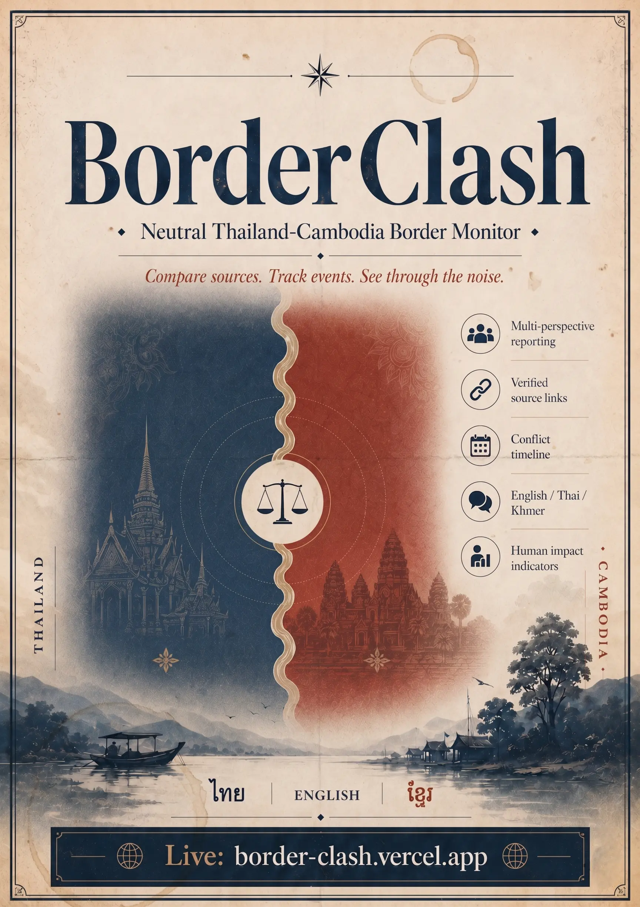

# BorderClash

**A neutral intelligence dashboard for the Thailand-Cambodia border situation.**

[Visit the live dashboard](https://border-clash.vercel.app) | [View the repository](https://github.com/South-33/BorderClash)

BorderClash turns fragmented, multilingual conflict reporting into a single, readable dashboard built for context instead of panic. It tracks developments from Thai, Cambodian, and international sources, then organizes them into neutral summaries, source-backed timelines, and clear situational indicators.

In a space where information can move faster than verification, BorderClash is designed to slow the reader down just enough to compare perspectives, check confidence, and understand what is known, disputed, or still emerging.

---

## What It Shows

### Multi-Perspective Reporting

BorderClash separates reporting streams by perspective so readers can see how the same situation is framed across Thailand, Cambodia, and international coverage. The goal is not to flatten disagreement, but to make the disagreement visible.

### Neutral Situation Briefs

The dashboard synthesizes active reporting into concise, balanced summaries that highlight key developments, uncertainty, and competing claims without adopting a national narrative.

### Conflict Timeline

Events are organized into a chronological timeline with source links, importance scoring, and status labels such as confirmed, disputed, or debunked. The timeline is built to help readers understand escalation, sequence, and context.

### Human Impact Indicators

BorderClash tracks high-level indicators such as conflict level, reported casualties, injuries, displacement, and recent changes. These figures are presented as monitored signals, not unquestionable final counts.

### Trilingual Access

The interface supports English, Thai, and Khmer so the dashboard is usable by the people closest to the issue, not only outside observers.

### Media Literacy Guide

The built-in guide helps readers evaluate conflict reporting: compare sources, look for evidence, check dates, and watch for emotional manipulation or propaganda framing.

---

## Why It Exists

Border incidents are often reported through scattered posts, local outlets, official statements, and rapidly changing headlines. That makes it difficult for ordinary readers to know what changed, what is verified, and what may be narrative pressure.

BorderClash was built as a public-facing monitor for that exact problem:

- Bring competing reports into one place.
- Preserve source context instead of hiding it.
- Make uncertainty explicit.
- Keep the interface readable across languages.
- Reduce the cost of staying informed without rewarding outrage.

---

## How It Works

BorderClash runs a research pipeline that searches for relevant reporting, verifies article links and topic fit, groups related reports into timeline events, and publishes a dashboard-ready snapshot.

The system is intentionally structured around comparison:

- **Scout** finds reporting from Thai, Cambodian, and international sources.
- **Source Verify** checks whether links are real, relevant, and consistent with the stored article.
- **Historian** turns verified reporting into deduplicated timeline events.
- **Synthesis** creates neutral summaries and multilingual dashboard text.

The live site is served through an ISR-style snapshot flow so readers get a fast dashboard without every page view creating fresh backend load.

---

## Built With

| Layer | Technology |
| --- | --- |
| Frontend | Next.js 16, React 19, TypeScript |
| Styling | Tailwind CSS 4, custom dashboard UI |
| Backend & data | Convex |
| AI workflow | Custom Gemini-compatible research and synthesis pipeline |
| Hosting | Vercel |

---

## Live Site

**BorderClash is live at [border-clash.vercel.app](https://border-clash.vercel.app).**

Open the dashboard, switch perspectives, inspect the timeline, and compare the sources behind each event.

---

## Project Status

BorderClash is an active monitoring experiment. It is not an official government source, a substitute for professional journalism, or a final authority on casualty and displacement figures. It is a tool for making public information easier to compare, question, and understand.
