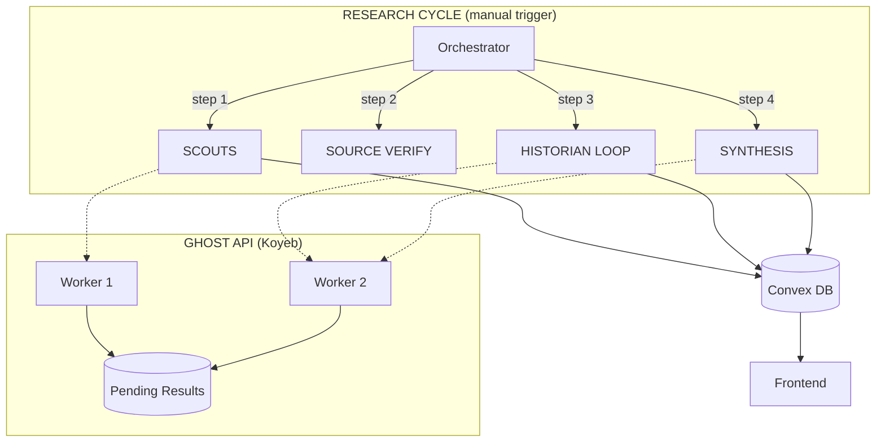

# BorderClash - Thailand-Cambodia Border Conflict Monitor

Real-time intelligence dashboard tracking the Thailand-Cambodia border situation with multi-perspective news and AI-powered neutral analysis.

## Features

- 🌐 **Trilingual UI** - English, Thai (ไทย), Khmer (ខ្មែរ) with casual/spoken translations
- 🔍 **Neutral AI Analysis** - Balanced perspective summaries, credibility scoring
- ⚔️ **Multi-Perspective** - Thailand, Cambodia, and International viewpoints
- 📅 **Interactive Timeline** - Chronological event display with swipe navigation
- 🤖 **Hierarchical AI System** - Scout → Source Verify → Historian → Synthesis pipeline
- 🛡️ **HTTP Timeout Recovery** - Automatic pending result polling when Koyeb times out
- 🔎 **Web Search Integration** - AI agents verify claims via live web search

---

## Architecture



### AI Components

| Component | Model | Role |
|-----------|-------|------|
| **SCOUT** | fast | Find new articles (isolated per country) |
| **SOURCE VERIFY** | fast | Visit URLs to verify article accuracy |
| **HISTORIAN** | thinking | Process articles → create/merge timeline events |
| **DASHBOARD** | thinking | Update stats (casualties, displaced) with web verification |
| **SYNTHESIS** | thinking | Generate multilingual narratives for frontend |

### HTTP Timeout Recovery (New!)

Koyeb has a ~120s gateway timeout. When the thinking model takes longer:

1. Ghost API stores completed results in `pending_results` dict
2. Convex detects 504, waits 45s, then polls `/v1/pending/{request_id}`
3. Result is retrieved even though original HTTP connection died

---

## Database Schema

### News Tables
`thailandNews`, `cambodiaNews`, `internationalNews`
- Articles with `active`, `outdated`, `unverified`, `false`, or `archived` status
- Multilingual titles/summaries (En, Th, Kh)
- `sourceVerifiedAt` - When AI verified the URL/content is real
- `processedToTimeline` - Tracks if Historian has processed this article

### Timeline Events
`timelineEvents`
- `date`, `timeOfDay` (for same-day ordering)
- `title`, `titleTh`, `titleKh` + descriptions
- `importance` (0-100 - controls dot size: 6px-40px)
- `status` (confirmed/disputed/debunked)
- `sources[]` array with credibility scores

### Dashboard Stats
`dashboardStats`
- **Displaced Count** with last updated timestamp
- **Casualties** (confirmed fatalities)
- **Civilian/Military Injured**
- **Conflict Level** (LOW/ELEVATED/CRITICAL)

---

## Tech Stack

| Layer | Technology |
|-------|------------|
| Frontend | Next.js 15 + Tailwind CSS |
| Backend | Convex |
| AI | Ghost API (Playwright + Gemini 2.0) |
| Hosting | Vercel (frontend) + Koyeb (Ghost API) |

### Environment Variables

```bash
npx convex env set GHOST_API_URL "https://your-ghost-api.koyeb.app"
```

---

## Quick Start

```bash
npm install
npx convex dev
npm run dev
```

### Administrative Commands

```bash
# Control automation
npx convex run api:pauseTimer
npx convex run api:resumeTimer
npx convex run api:skipNextCycle

# Manual triggers
npx convex run api:runFullCycle
npx convex run api:runHistorian
npx convex run api:runDashboardUpdate

# Data management
npx convex run api:clearAllData
```

---

## UI Features

- **Sticky Date Header** - Shows current visible date while scrolling timeline
- **Mobile Swipe Navigation** - Swipe between event details
- **Date Picker** - Horizontal scrollable dates with auto-sync to scroll position
- **Damage Assessment Cards** - Displaced, Fatalities, Injuries, Threat Level
- **Guide Section** - Fact vs Propaganda, Verification Checklist, Source Categories

## Translation Guidelines

- **Thai**: ภาษาพูด (spoken Thai) - casual everyday language
- **Khmer**: ភាសាប្រចាំថ្ងៃ (everyday Khmer) - conversational tone
- **Numerals**: Always use English numerals (0-9), never Thai ๑๒๓ or Khmer ១២៣

---

## Scaling Plan (If This gets more users)

### Current Limits (Convex Free Tier)
- **1 GB bandwidth/month** → ~1,500-2,000 page loads
- Current optimizations: `useCachedQuery` reduces live subscriptions by ~90%

### Scale-Up Architecture: Firebase Cache

```
┌─────────────────┐     sync      ┌─────────────────┐     serve     ┌─────────┐
│  Convex (AI)    │ ───────────►  │  Firebase       │ ───────────►  │  Users  │
│  ~100MB/month   │  (every 3hr)  │  10GB/month!    │               │         │
└─────────────────┘               └─────────────────┘               └─────────┘
```

### Implementation Steps
1. **Convex cron** syncs data to Firebase Firestore after each AI cycle
2. **Next.js API routes** read from Firebase instead of Convex
3. **Frontend** calls API routes (not Convex SDK directly)

### Free Tier Comparison

| Service | Free Bandwidth | Capacity |
|---------|---------------|----------|
| Convex | 1 GB/month | ~2,000 users |
| **Firebase Firestore** | **10 GB/month** | **~40,000 users** |
| Cloudflare R2 | Unlimited egress | ∞ (object storage) |
| Google Cloud Storage | ~30 GB/month | ~120,000 users |

### When to Implement
- If monthly page loads exceed **1,500**
- If Convex dashboard shows bandwidth warnings
